####  Introduction to big data analysis in bioinformatics WS 22/23

### **Concepts in sequencing data analysis**

Cristobal Gallardo Alba

------

---

Table of contents

## Table of contents

 

- **Sequencing technologies**
- **Information storage**
- **Applications of sequencing**

------

## Table of contents

 

- **Sequencing technologies**
    - NGS technologies: Illumina
    - TGS technologies: Nanopore & PacBio
- **Information storage**
- **Applications of sequencing**

------

## Table of contents

 
    
- **Sequencing technologies**
- **Information storage**
    - Phred quality score
    - FASTQ format
- **Applications of sequencing**

------

## Table of contents

 
    
- **Sequencing technologies**
- **Information storage**
- **Applications of sequencing**
    - Genome assembly
    - Transcriptomics: gene expression analysis
    - Epigenetics

---

Sequencing technologies

## Sequencing technologies

------

NGS technology: Illumina

### NGS technology: Illumina

Source: https://www.intechopen.com/
    

Note:
    
This sequencing method is based on reversible dye-terminators that enable the identification of single nucleotides.
  
With this technology, thousands of places throughout the genome are sequenced at once via massive parallel sequencing.

------

### NGS technology: Illumina
#### Base calling

  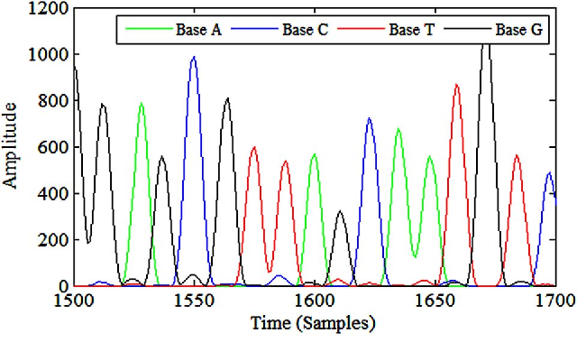
  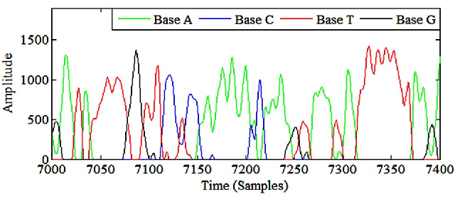

------

TGS technology: Oxford Nanopore

### TGS technology: Oxford Nanopore

Source: https://www.ukaachen.de
    

------

### TGS technology: Oxford Nanopore
#### Base calling

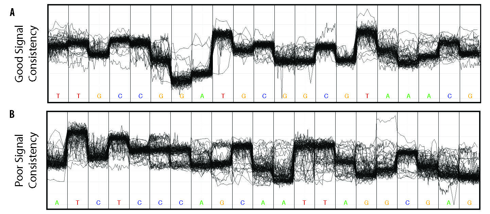

------

TGS technologies: PacBio

### TGS technologies: PacBio

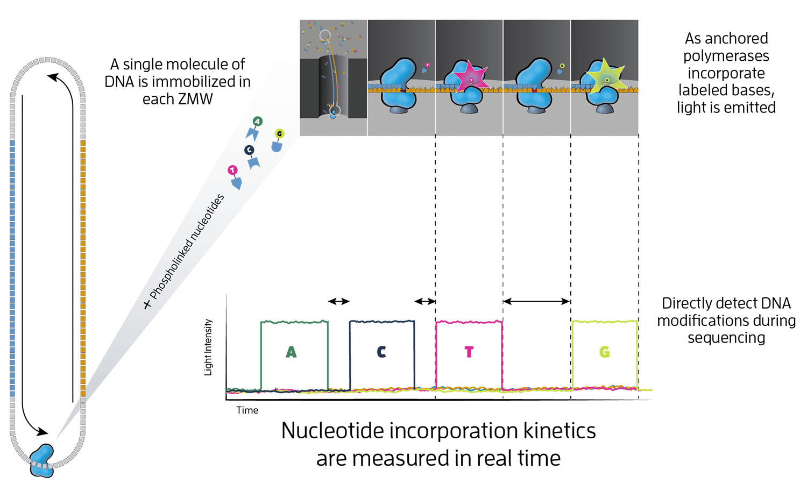

---

Information storage

## Information storage

------

File formats: FASTQ

### Information storage: FASTQ datatype

------

File formats: Phred score

### Information storage: Phred quality score

<pre><code data-trim data-noescape >
@ERR4760040.1 MN00415:74:FREIBURG:1
TATAGCTCGCAAATCGTATCAGCAGATGTAATCAGGTAATGAAGTAGTTCTAGTTCTAGTTCTA
+
&%%)'/5516:;-,*&,)+1.-3(+-)%&+623196366-+-')*029==*029==*029==*0
</code></pre>

Phred quality score is used to indicate the measure of base quality in DNA/RNA sequencing. 

$$
Q = -10\log_{10}p \rightarrow p = 10^{\frac{-Q}{10}}
$$

 <small>*p: error probability associated with any given basecall*</small> 
<small>*Q: quality score, encoded in ASCII characters*</small>

------

### Information storage: Phred quality score

------

Information storage: SAM/BAM datatype

### Information storage: SAM/BAM datatypes

 

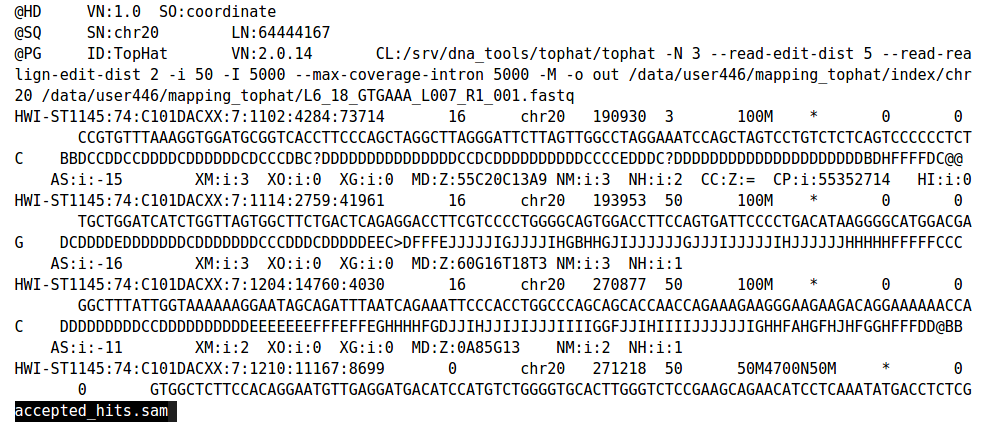

---

Applications of sequencing technologies

## Applications of sequencing technologies

------

Genome assembly

### Genome assembly
    
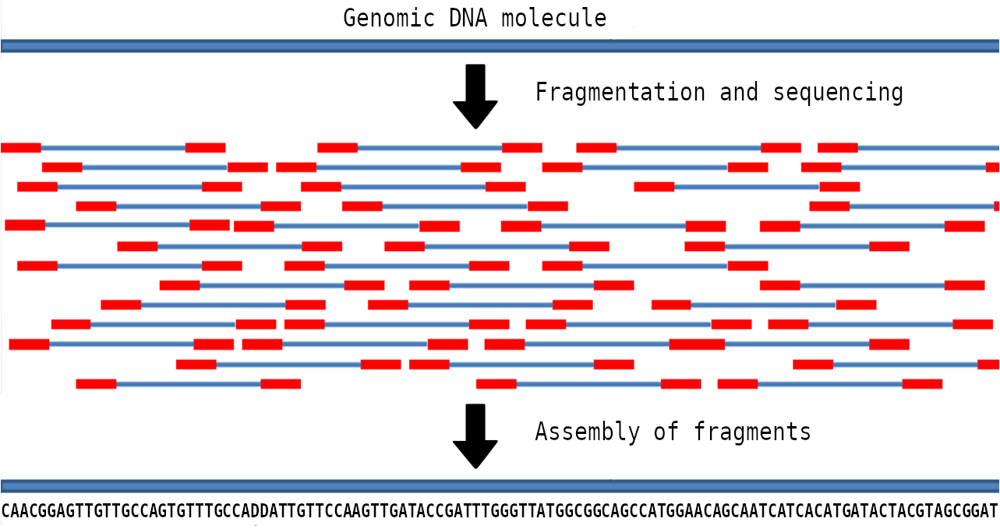

------

### Genome assembly
#### VGP assembly workflow
    
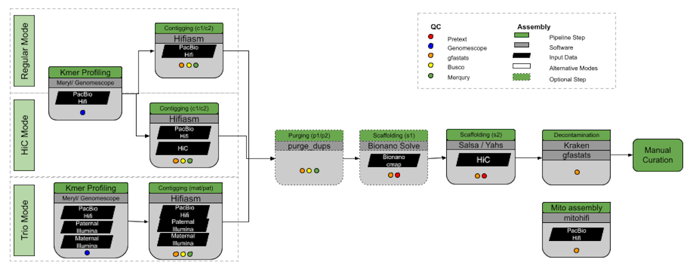

------

### Genome assembly
#### VGP assembly workflow in Galaxy

- The VGP-Galaxy project has assembled 26 genomes in the last 6 months
- Largest: 4Gbp *Gastrophryne carolinensis*

------

Transcriptomics: expression analysis

### Transcriptomics: RNA-seq

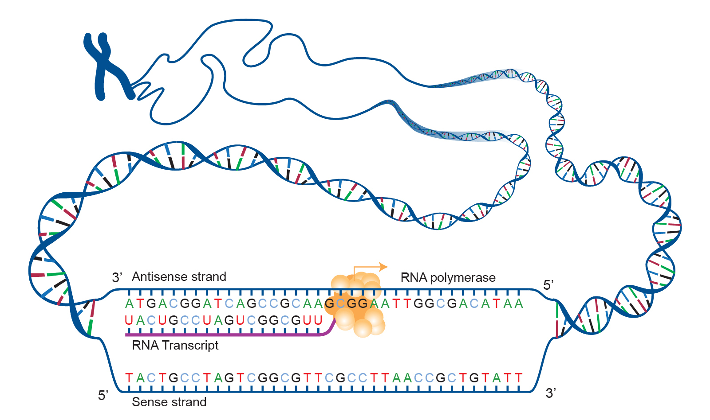

differential_expression.png

------

### Transcriptomics: RNA-seq
#### Differential expression analysis pipeline

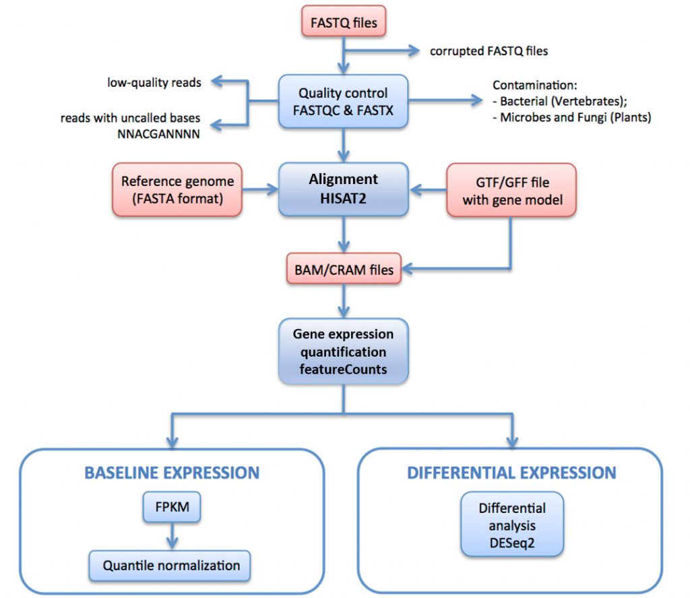

------

### Transcriptomics: RNA-seq
#### Differential expression analysis

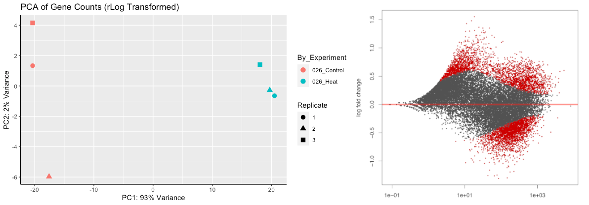

------

Epigenetics

### Epigenetics

------

DNA/RNA methylation

### Epigenetics
#### Heritable marks: DNA/RNA methylation

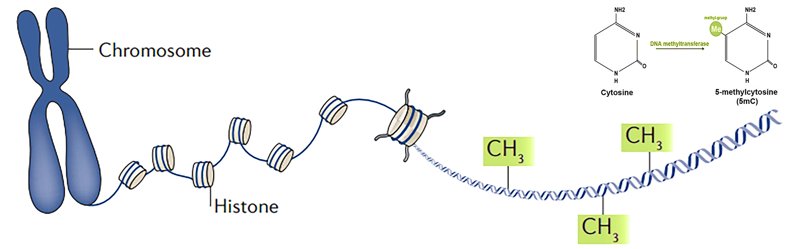

<small>DNA/RNA methylation **regulates gene expression** by recruiting proteins involved in gene repression or by inhibiting the binding of transcription factor(s) to DNA.</small>

------

### Epigenetics
#### Heritable marks: DNA/RNA methylation

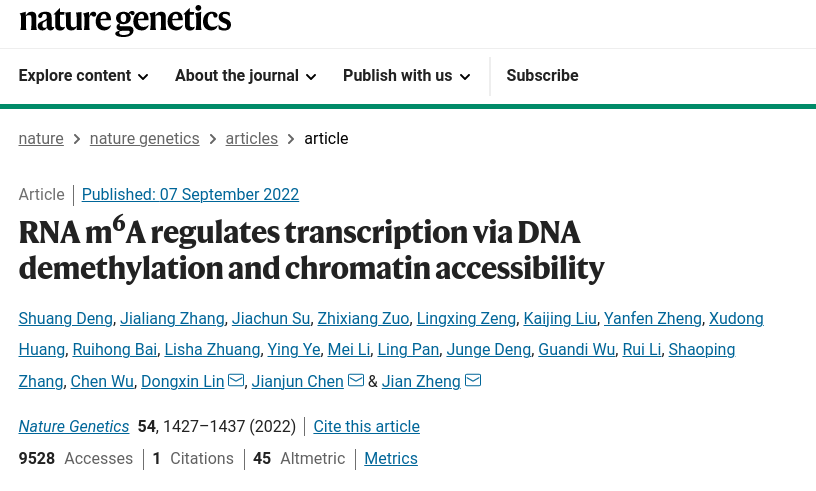

------

Cancer molecular markers

### Epigenetics
#### Cancer molecular markers

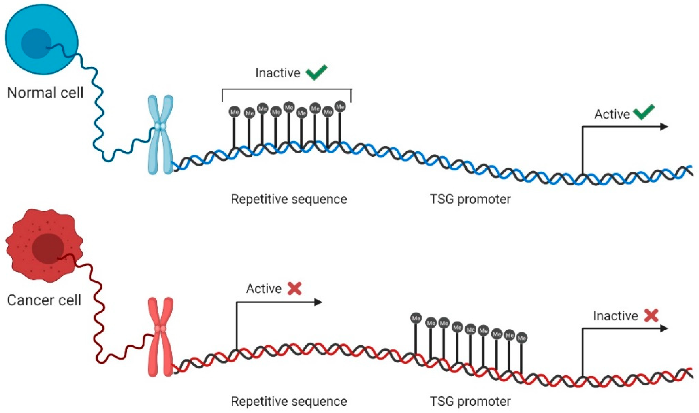

------

### Epigenetics
#### Cancer molecular markers

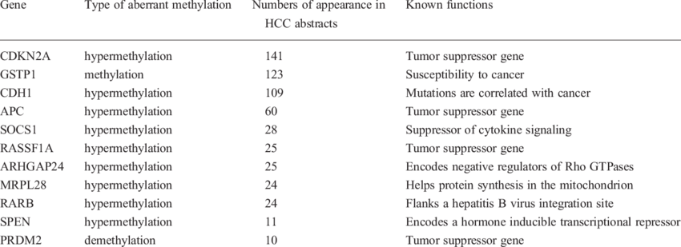

------

Plant resistance to extreme conditions

### Epigenetics
#### Plant resistance to extreme conditions

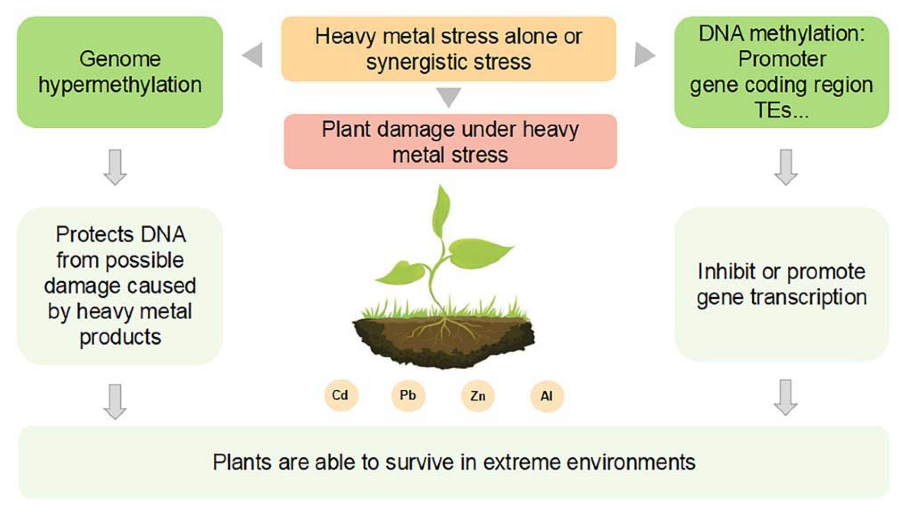

<small><small>Plant stress memory and their capacity to influence plant tolerance to a changing environment and crop productivity is considered to play an important role in the adaptation and evolution of plants.</small></small>

------

### Epigenetics
#### Plant resistance to extreme conditions

<small><small>"Environment-induced changes are the primary mechanism of heritability." -- Trofim Denisovich Lysenko (1898-1976)</small></small>

------

Neurodegenerative disorders

### Epigenetics
#### Neurodegenerative disorders

