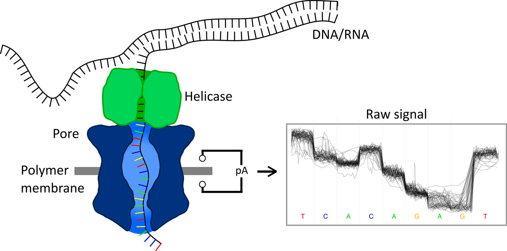
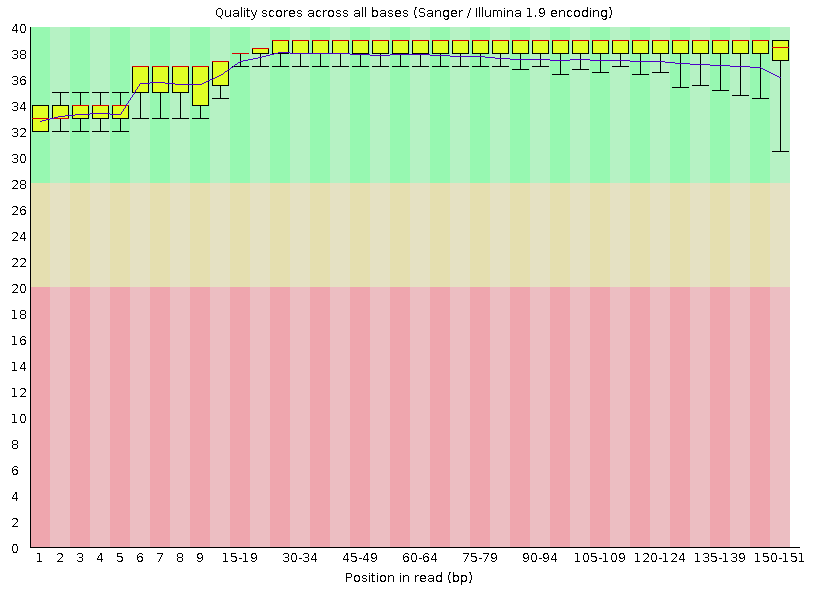
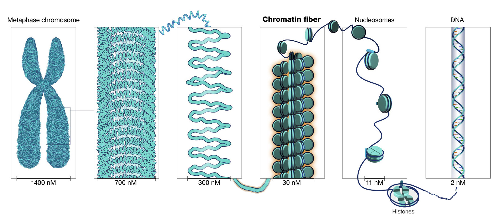
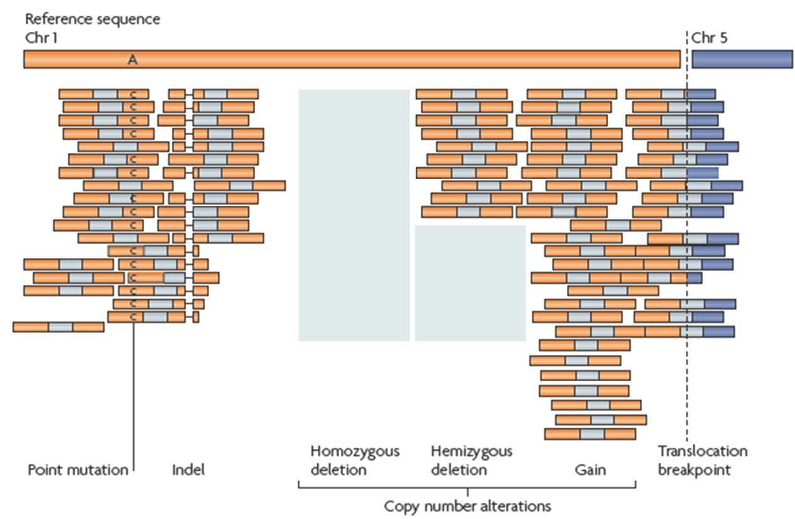
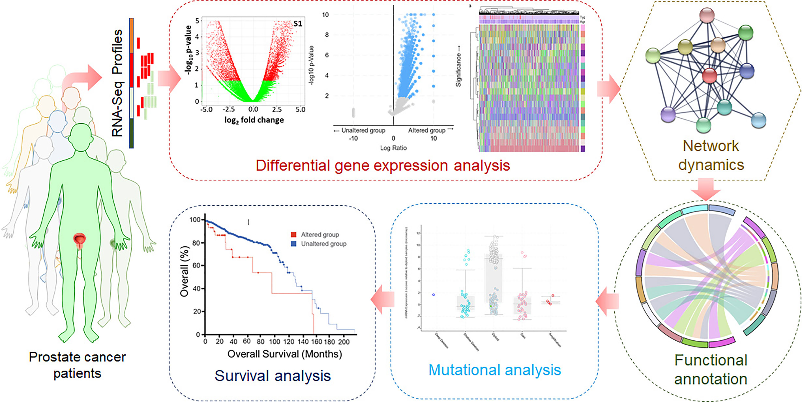
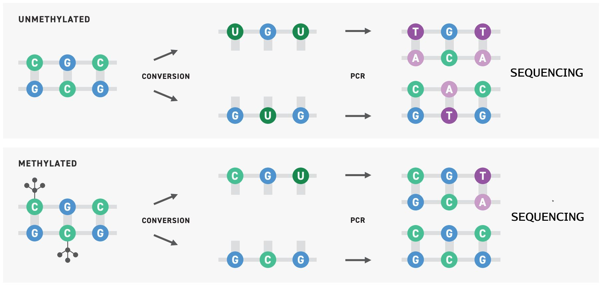

####  Introduction to big data analysis in bioinformatics WS 22/23

### **Concepts in sequencing data analysis**

Cristobal Gallardo Alba

------

---

Table of contents

### Table of contents

- **Sequencing technologies**
    - NGS technologies: Illumina
    - TGS technologies: Nanopore & PacBio
- **Information storage**
    - FASTQ datatype
    - Phred quality score
    - SAM/BAM datatype
- **Applications of sequencing**
    - Genome assembly
    - Transcriptomics: gene expression analysis
    - Epigenetics

---

Sequencing technologies

## Sequencing technologies

------

NGS technology: Illumina

### NGS technology: Illumina

Source: https://www.intechopen.com/
    

#### Base calling

Note:
    
This sequencing method is based on reversible dye-terminators that enable the identification of single nucleotides.
  
With this technology, thousands of places throughout the genome are sequenced at once via massive parallel sequencing.

------

TGS technology: Oxford Nanopore

### TGS technology: Oxford Nanopore

Source: https://www.ukaachen.de
    

#### Base calling

------

TGS technologies: PacBio

### TGS technologies: PacBio

---

Information storage

## Information storage

------

File formats: FASTQ

### Information storage: FASTQ datatype

------

File formats: Phred score

### Information storage: Phred quality score

<pre><code data-trim data-noescape >
@ERR4760040.1 MN00415:74:FREIBURG:1
TATAGCTCGCAAATCGTATCAGCAGATGTAATCAGGTAATGAAGTAGTTCTAGTTCTAGTTCTA
+
&%%)'/5516:;-,*&,)+1.-3(+-)%&+623196366-+-')*029==*029==*029==*0
</code></pre>

Phred quality score is used to indicate the measure of base quality in DNA/RNA sequencing. 

$$
Q = -10\log_{10}p \rightarrow p = 10^{\frac{-Q}{10}}
$$

 <small>*p: error probability associated with any given basecall*</small> 
<small>*Q: quality score, encoded in ASCII characters*</small>

------

Information storage: SAM/BAM datatype

### Information storage
#### SAM/BAM datatype

 

---

Applications of sequencing technologies

## Applications of sequencing technologies

------

Genome assembly

### Genome assembly

Source: https://www.genome.gov
    

------

### Genome assembly
#### VGP *de novo* assembly workflow

- The VGP-Galaxy project has assembled 26 genomes in the last 6 months
- Largest: 4Gbp *Gastrophryne carolinensis*

------

### Genome assembly
#### Within-species variation: resequencing

<small><small>The butterfly genus *Heliconius* contains some species that are extremely difficult to tell apart.</small></small>

<small><small>Source: nature.com</small></small>

------

Transcriptomics: expression analysis

### Transcriptomics: RNA-seq

<small><small>Source: metrics-lab.github.io</small></small>

------

### Transcriptomics: RNA-seq
#### Expression genetics in cancer

------

### Transcriptomics: RNA-seq
#### Differential expression analysis pipeline

<small><small>Source: nature.com</small></small>

------

### Epigenetics

------

Epigenetics
    
### Epigenetics

Epigenetics is the study of **stable and inheritable phenotypic changes** that do not involve alterations in the DNA sequence.

 

It involves multiple mechanisms:
    
- Covalent modifications (e.g. DNA/RNA methylation)
- Histone positioing
- Histone variants
- Many more!

Detection requires usually  a three-phase strategy:

 

- Conversion of epigenetic into genetic information
    - Usually by biochemical methods
- High-throughput sequencing
- Computational and statisticall analysis

------

DNA/RNA methylation

### Epigenetics
#### Covalent modifications: DNA/RNA methylation

<small>DNA/RNA methylation **regulates gene expression** by recruiting proteins involved in gene repression or by inhibiting the binding of transcription factor(s) to DNA.</small>

<small><small>Bisulfite sequencing involves the deamination of unmodified cytosines to uracil.</small></small>

------

Cancer molecular markers

### Epigenetics
#### Covalent modifications: Cancer molecular markers

<small><small>Source: nature.com</small></small>

------

Plant resistance to extreme conditions

### Epigenetics
#### Covalent modicitations: Plant resistance to extreme conditions

<small><small>Plant stress memory and their capacity to influence plant tolerance to a changing environment and crop productivity is considered to play an important role in the adaptation and evolution of plants.</small></small>
    

<small><small>"Environment-induced changes are the primary mechanism of heritability." -- Trofim Denisovich Lysenko (1898-1976)</small></small>

------

Neurodegenerative disorders

### Epigenetics
#### Covalent modifications: Neurodegenerative disorders

